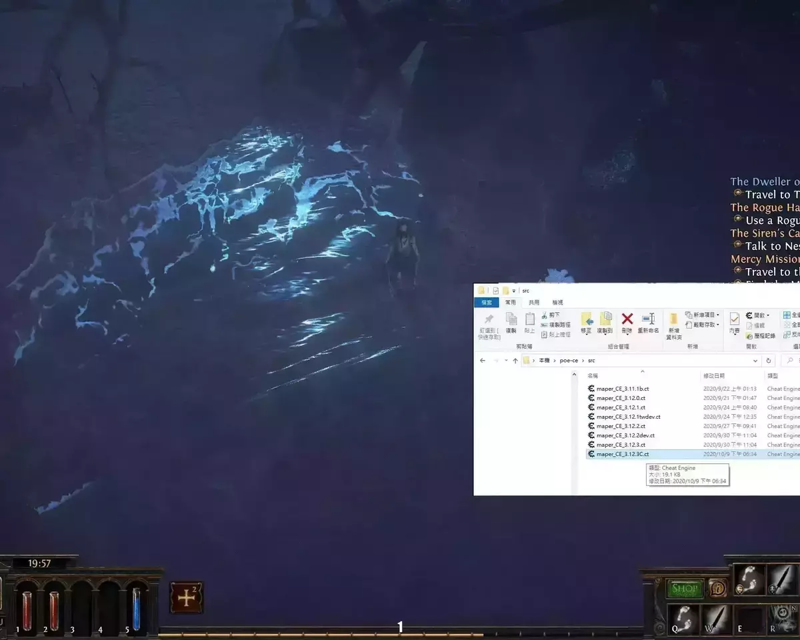

# poe-ce: Maphack, zoomhack, Light, and more

### [Click here to download the latest version](https://github.com/zxc88645/poe-ce/raw/master/ct/maper_CE_3.12.4.zip)

#### [Click here for support ( Ownedcore )](https://www.ownedcore.com/forums/mmo/path-of-exile/poe-bots-programs/923296-maphack-zoomhack-light-more-3-12-ct.html)

## Overview

  This is a collection of quality of life features for Path of Exile. It's designed to be lightweight and easy to use.

## Features
  * Custom resolution (自訂解析度)
	  - X resolution Width (default: 800)
	  - Y resolution Height (default: 600)
      * **If X and Y = -1, Get Black screen**
      * **Double click "Value" to change**

  * Maphack (地圖全開)
      - Reveals the entire minimap.
      - Option to "ghostwalk", or prevent the game from saving your map reveal progress.
      - Option to reset reveal progress on the map.
  * Zoomhack (無限視野)
      - Unlimited zoom range with the mouse wheel.
      - Unlimited zoom range with the keyboard.
      - Option to disable distance fog.
      - Option to disable far plane culling.
* Always show enemy health bars.
* Increase player lighting in dark areas.
* **Only tested with the 64-bit standalone client. It may work for Steam and Kakao but these are rarely tested so support is never guaranteed.**
* **我來自台灣所以 Garena (TW) 通常可以用(I'm from Taiwan so Garena (TW) can usually be used)**  

## Disclaimer

  Cheating is bad. Using this is against the game's terms of use.  
  This is currently not detected; however, there is nothing preventing,  
  the anti-cheat from detecting this. Be very cautious about using this on accounts that you care about.  
  **There is always a risk.**  

## Donate

  If u can, Let me have a cup of coffee while developing,  
  
  BTC: `3KuWGjbQ5BVZBdYzWbKWsAQcGBQiqwF9yh`

  My appreciation is beyond expression.

## Requirements

  You will need to have [Cheat Engine](https://cheatengine.org) installed to use this.

## Quick Start

  1. Start the game.
  2. Start up Cheat Engine.
  3. Go to "File" and "Open Process" , and select the Path of Exile process from the list.
  4. Go to "File" and "Load ", and open the .CT file you downloaded from here.
  5. *Optional: If you're using a Steam or Kakao client, scroll down the list of check boxes and check the Steam or Kakao box.*
  6. Check the boxes for the features you want to enable.

  

## Hotkeys

* **Shift + F5**: Toggle ghostwalking.
* **Shift + F6**: Toggle map reveal.
* **Shift + F7**: Toggle increased lighting.

## Tips and Tricks
    
    
### Preserving your actual exploration while using maphack
      
  Normally when you enable maphack, the map will be permanently explored and you won't be able to see what areas you've actually explored.  

  You can use ghostwalking before you enable maphack to prevent maphack from permanently revealing the map. Press Shift + F5 to enable ghostwalk, then Shift + F6 to enable maphack.  
  
  When you have an idea of the map layout you can press Shift + F6 to disable maphack and Shift + F5 to disable ghostwalk.  

  Then your map exploration will be back to normal. Rinse and repeat when you want to check the full map again.  
  
  As long as ghostwalking is enabled when you enable maphack, you won't lose your exploration progress.  

  Keep in mind that any exploration you do while ghostwalking is enabled will not be saved.  
    
### Accidentally revealed the whole map with ghostwalking disabled
  
  Sometimes you might accidentally load into an area and enable maphack without ghostwalking enabled.  

  If you do this and you didn't want to permanently reveal the map, you can enable the reset map option under maphack and then disable it again.  
  
  This will reset all exploration progress on the current map.  

## Configuring
  
  You can change the configuration of some of the features by right-clicking on it in the list, and selecting Change Script.  

  If the feature can be configured, how to do so will be described in the comments of that script.  

## Thanks and Credits

  The following people originally wrote some of these features or gave me helpful information over the years.

* zaafar
* ankorman
* TehCheat
* m4p3r
